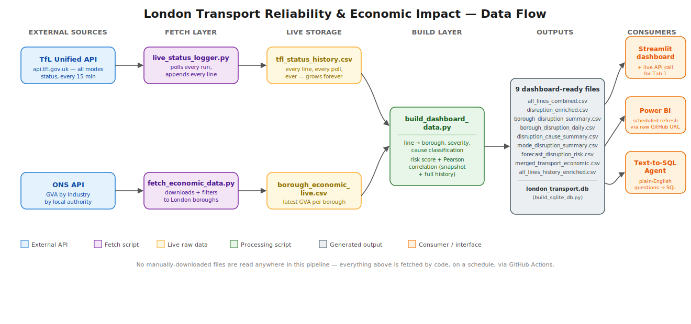
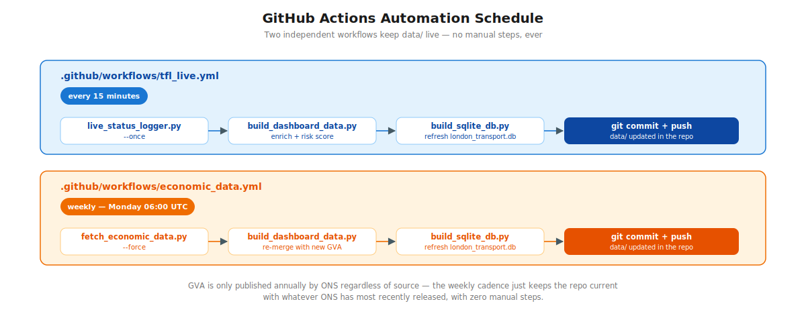

# 🚇 London Transport Reliability & Economic Impact

> **Does transport unreliability hit outer London harder than the centre — and what does it cost the economy?**
>
> This project polls **live** TfL service status across all modes (Tube, Overground, DLR, Elizabeth line), classifies disruptions by root cause, joins them to **live** ONS borough-level GVA data, and surfaces the result through a real-time Streamlit dashboard and a Power BI report. No manually-downloaded files are read anywhere in the pipeline — everything is fetched by code, on a schedule, via GitHub Actions.

---

## Table of Contents

- [🚇 London Transport Reliability \& Economic Impact](#-london-transport-reliability--economic-impact)
  - [Table of Contents](#table-of-contents)
  - [1. Project Overview](#1-project-overview)
  - [2. Architecture](#2-architecture)
    - [2.1 Data flow](#21-data-flow)
    - [2.2 Automation schedule](#22-automation-schedule)
  - [3. Data Sources (Live APIs)](#3-data-sources-live-apis)
  - [4. Project Structure](#4-project-structure)
  - [5. Data Files Explained](#5-data-files-explained)
  - [6. What Each Script Does](#6-what-each-script-does)
    - [`scripts/live_status_logger.py`](#scriptslive_status_loggerpy)
    - [`scripts/fetch_economic_data.py`](#scriptsfetch_economic_datapy)
    - [`scripts/build_dashboard_data.py`](#scriptsbuild_dashboard_datapy)
    - [`dashboard.py`](#dashboardpy)
  - [7. How to Run](#7-how-to-run)
    - [Install dependencies](#install-dependencies)
    - [Local first run](#local-first-run)
    - [Ongoing local use (optional)](#ongoing-local-use-optional)
    - [Power BI](#power-bi)
  - [8. GitHub Actions Automation](#8-github-actions-automation)
  - [9. Power BI Report](#9-power-bi-report)
  - [10. Example Output (point-in-time snapshot)](#10-example-output-point-in-time-snapshot)
  - [11. Future Enhancements](#11-future-enhancements)

---

## 1. Project Overview

Public transport delays, strikes, and infrastructure failures don't affect all areas equally. This project investigates whether transport unreliability disproportionately impacts commuters in outer boroughs compared to central London, and correlates disruption patterns with each borough's economic output (GVA).

The pipeline runs continuously and unattended:

**TfL API → history log → enrichment/risk scoring → Streamlit (real-time) + Power BI (scheduled refresh)**, with a parallel, slower branch pulling GVA from ONS.

Two different "live" speeds, by design: the Streamlit dashboard hits the TfL API directly per visitor (true real-time); Power BI refreshes on a schedule reading the repo's GitHub-hosted CSVs (a reporting cadence, not a live ticker).

---

## 2. Architecture

### 2.1 Data flow



### 2.2 Automation schedule



GVA is only published annually by ONS regardless of source — the weekly cadence
just means the repo always reflects whatever ONS has most recently released,
with zero manual steps.

*(Diagram source files are hand-authored SVG, not Mermaid — GitHub's Mermaid
renderer can silently fail depending on the viewing context, so these are
committed as plain images instead. To edit them, open the `.svg` source in
`docs/images/` in any text editor or vector tool and re-export to `.png`.)*

---

## 3. Data Sources (Live APIs)

| Source | Endpoint | Fetched by | Cadence |
|---|---|---|---|
| TfL Unified API | `https://api.tfl.gov.uk/Line/Mode/tube,dlr,overground,elizabeth-line/Status?detail=true` | `scripts/live_status_logger.py` | Every 15 min (GitHub Actions) |
| ONS GVA by Local Authority | `https://download.ons.gov.uk/downloads/datasets/gva-by-industry-by-local-authority/...` | `scripts/fetch_economic_data.py` | Weekly (GitHub Actions) |
| TfL Unified API (again) | Same as above | `dashboard.py` directly, browser-side | Every visitor, cached 2 min |

No spreadsheet, JSON export, or file of any kind is downloaded by hand anywhere
in this pipeline.

---

## 4. Project Structure

```
London_Transport_Reliability_and_Economic_Impact/
│
├── scripts/
│   ├── dashboard.py                    # Streamlit dashboard — single source of truth
│   ├── live_status_logger.py           # Fetch layer — TfL API → tfl_status_history.csv
│   ├── fetch_economic_data.py          # Fetch layer — ONS API → borough_economic_live.csv
│   ├── build_dashboard_data.py         # Enrichment + risk scoring + correlation, all outputs
│   └── build_sqlite_db.py              # Loads the 7 dashboard-ready CSVs into london_transport.db
│
├── docs/images/
│   ├── architecture_dataflow.svg / .png
│   └── automation_schedule.svg / .png
│
├── .github/workflows/
│   ├── tfl_live.yml                   # Every 15 min
│   └── economic_data.yml              # Weekly
│
├── power_bi/
│   ├── POWERBI_GUIDE.md
│   ├── PowerBI_Setup_Guide_livedata.md
│   └── powerbi_step_by_step_guide.html
│
└── data/
    │
    ├── ── LIVE INPUTS (fetched by scripts, never hand-edited) ──────
    ├── tfl_status_history.csv          # Every line, every 15-min poll, growing forever
    ├── borough_economic_live.csv       # Latest ONS GVA per London borough
    │
    ├── ── GENERATED OUTPUTS (dashboard + Power BI inputs) ──────────
    ├── all_lines_combined.csv          # Latest poll, all lines, enriched
    ├── disruption_enriched.csv         # Latest poll, disrupted lines only + cause
    ├── merged_transport_economic.csv   # Latest poll joined to borough GVA
    ├── borough_disruption_summary.csv  # Borough KPI table (current snapshot)
    ├── borough_disruption_daily.csv    # Borough × day — the trend dataset
    ├── disruption_cause_summary.csv    # Cause breakdown (current snapshot)
    ├── mode_disruption_summary.csv     # Per-mode disruption rate (current snapshot)
    ├── forecast_disruption_risk.csv    # Composite risk score + estimated GVA at risk
    ├── all_lines_history_enriched.csv  # Full enriched history, every poll
    ├── correlation_report.txt          # Pearson correlations — snapshot AND full history
    └── london_transport.db             # SQLite database (build_sqlite_db.py) — powers the text-to-SQL agent
```

---

## 5. Data Files Explained

| File | Grain | Key Columns | Notes |
|---|---|---|---|
| `tfl_status_history.csv` | one row per line per poll | timestamp, name, statusSeverity, reason | Raw TfL fetch, no enrichment — the append-only ledger everything else derives from |
| `borough_economic_live.csv` | one row per borough | Borough, total_gva_m, gva_year | Raw ONS fetch, filtered to London |
| `all_lines_combined.csv` | one row per line, latest poll | name, borough, severity_label, is_disrupted | "Current status" view |
| `disruption_enriched.csv` | one row per disrupted line, latest poll | disruption_cause, affected_section | Root-cause detail |
| `borough_disruption_summary.csv` | one row per borough, latest poll | disruption_rate_pct, average_severity, total_gva_m | Core KPI table |
| `borough_disruption_daily.csv` | one row per borough per calendar day | disruption_rate_pct over time | Grows every day the pipeline runs — feeds the trend chart |
| `disruption_cause_summary.csv` | one row per cause | incidents, avg_severity | Root-cause breakdown |
| `mode_disruption_summary.csv` | one row per mode | disruption_rate_pct | Per-mode comparison |
| `forecast_disruption_risk.csv` | one row per borough | composite_risk_score, risk_band, estimated_gva_at_risk_m | Risk scoring output |
| `correlation_report.txt` | text | Pearson r/p, both snapshot-only and full-history | Statistical significance improves as more days accumulate |

---

## 6. What Each Script Does

### `scripts/live_status_logger.py`
Polls the TfL API for **every** line on **every** mode (not just disrupted ones — needed to compute rates, not just counts) and appends one row per line to `tfl_status_history.csv`. Supports `--once` (used by the GitHub Actions cron) and `--loop` (continuous polling, for running on your own machine).

### `scripts/fetch_economic_data.py`
Downloads the latest ONS "GVA by industry by local authority" release, auto-detects the relevant columns (ONS occasionally renames them between releases — this script prints what it detected so you can sanity-check), filters to the 33 London boroughs, and aggregates to one total-GVA figure per borough.

### `scripts/build_dashboard_data.py`
The single processing script (replaces the old `data_integration.py` + `correlation_analysis.py`):
- Maps each line to its borough (`LINE_TO_BOROUGH`)
- Labels severity codes (`SEVERITY_LABELS`)
- Classifies disruption cause from the `reason` text via regex (`CAUSE_PATTERNS`)
- Builds the latest-snapshot and full-history borough summaries
- Computes a composite risk score: `0.6 × severity_risk + 0.4 × rate_risk`
- Runs Pearson correlation twice — once on the latest snapshot (few data points), once across the full borough × day history (grows richer every day)

### `dashboard.py`
Four tabs — Live Status (includes a panel calling the TfL API directly, independent of the batch schedule), Disruption Analysis (includes the daily trend chart), Economic Impact, Forecast & Risk.

---

## 7. How to Run

### Install dependencies
```bash
pip install pandas scipy streamlit plotly requests schedule
```

### Local first run
```bash
python scripts/live_status_logger.py --once
python scripts/fetch_economic_data.py
python scripts/build_dashboard_data.py
streamlit run dashboard.py
```

### Ongoing local use (optional)
```bash
python scripts/live_status_logger.py --loop --interval 5
```
Runs continuously, polling every 5 minutes — useful if you want history building up locally rather than waiting on the GitHub Actions schedule.

### Power BI
See [Section 9](#9-power-bi-report).

---

## 8. GitHub Actions Automation

Two workflows keep the repo's `data/` folder live without any manual steps:

| Workflow | Schedule | Does |
|---|---|---|
| `.github/workflows/tfl_live.yml` | Every 15 min | `live_status_logger.py --once` → `build_dashboard_data.py` → commit |
| `.github/workflows/economic_data.yml` | Weekly, Mon 06:00 UTC | `fetch_economic_data.py --force` → `build_dashboard_data.py` → commit |

**Required repo secrets** (Settings → Secrets and variables → Actions): `TFL_APP_ID`, `TFL_APP_KEY` — register free at https://api-portal.tfl.gov.uk/.

**Required permission**: Settings → Actions → General → Workflow permissions → "Read and write permissions" (so the workflow can push data back).

---

## 9. Power BI Report

The `.pbix` files live in `data/power_bi/` and are connected directly to this
repo's raw GitHub CSV URLs (`raw.githubusercontent.com/.../data/<file>.csv`) —
so Power BI's scheduled refresh pulls whatever the GitHub Actions workflows
most recently committed, with no gateway required (the source is public web,
not a local file).

Full step-by-step setup — which file feeds which visual, relationships, DAX
measures, publishing, and scheduled refresh — is in:
- `power_bi/PowerBI_Setup_Guide_livedata.md` (current, matches the live pipeline)
- `power_bi/POWERBI_GUIDE.md` / `power_bi/powerbi_step_by_step_guide.html` (earlier drafts — safe to remove once the live guide is confirmed working)

---

## 10. Example Output (point-in-time snapshot)

The numbers below are a single real snapshot pulled while writing this README —
**they will differ every time you look**, since the pipeline is live. Treat
this as "here's what the shape of the data looks like," not a fixed result.

**Mode disruption rate:**

| Mode | Total Lines | Disrupted | Disruption Rate |
|---|---|---|---|
| Tube | 11 | 1 | 9.1% |
| Overground | 6 | 0 | 0.0% |
| Elizabeth line | 1 | 1 | 100.0% |
| DLR | 1 | 0 | 0.0% |

**Correlation report (`correlation_report.txt`):**

```
Pearson Correlations (latest snapshot only, n=9):
  Severity vs Borough GVA: r=-0.098, p=0.818  [not yet significant]
  Disruption Rate % vs GVA: r=0.098, p=0.818  [not yet significant]

Pearson Correlations (full history, borough x day, n=45):
  Severity vs Borough GVA: r=0.051, p=0.753  [not yet significant]
  Disruption Rate % vs GVA: r=-0.086, p=0.599  [not yet significant]
```

Correlations are still not significant — expected this early. `n` grows by 9
(one per borough) every additional day the pipeline runs, so significance is
a matter of letting it accumulate, not changing the method.

## 11. Future Enhancements

| Enhancement | Description |
|---|---|
| Fix Westminster/City of London GVA gap | Correct the borough-name matching in `fetch_economic_data.py` |
| Geospatial map | Borough boundary GeoJSON + Power BI Shape Map, coloured by risk score |
| Strike overlay | Historical strike-date reference lines on the trend chart |
| Threshold alerts | Power BI alert or email when `composite_risk_score` exceeds e.g. 0.6 |
| Outer-borough line coverage | Expand `LINE_TO_BOROUGH` to secondary boroughs each line serves |
| Predictive risk model | Train on `all_lines_history_enriched.csv` once enough history has accumulated |
| Employment / sales metrics | The old kMatrix dataset had these; no free live equivalent exists yet — Nomis API is a possible source but needs a one-time query built via their site before it can be automated |

---

*Built with Python · pandas · scipy · requests · Streamlit · Plotly · Power BI*
*Live data: TfL Unified API · ONS GVA by Local Authority*
